# Zort


Implementation of 13 sorting algorithms in Zig

| Algorithm               | Custom Comparison | Zero Allocation |
| ----------------------- | ----------------- | --------------- |
| Bubble                  | ✅                | ✅              |
| Comb                    | ✅                | ✅              |
| Heap                    | ✅                | ✅              |
| Insertion               | ✅                | ✅              |
| Merge                   | ✅                | ❌              |
| PDQ                     | ✅                | ✅              |
| Quick                   | ✅                | ✅              |
| Radix (no negative yet) | ❌                | ❌              |
| Selection               | ✅                | ✅              |
| Shell                   | ✅                | ✅              |
| Tail                    | ✅                | ❌              |
| Tim                     | ✅                | ❌              |
| Twin                    | ✅                | ❌              |

## Usage

```zig
const zort = @import("zort");

fn asc(a: u8, b: u8) bool {
    return a < b;
}

pub fn main() !void {
    var arr = [_]u8{ 9, 1, 4, 12, 3, 4 };
    try zort.quickSort(u8, &arr, asc);
}
```

## Benchmarks

run this to see resulst on your machine:
```
zig build bench -Doptimize=ReleaseFast -- tim pdq quick radix twin std_block_merge comb shell
```

### Intel(R) Core(TM) i7-4600U CPU @ 2.10GHz

```mermaid
gantt
    title Sorting (ascending) 10000000 usize
    dateFormat x
    axisFormat %S s
    section random
    tim 2.172: 0,2173
    pdq 0.435: 0,435
    quick 0.860: 0,860
    radix 0.318: 0,318
    twin 1.069: 0,1069
    std_block_merge 1.327: 0,1327
    comb 1.540: 0,1540
    shell 2.301: 0,2299
    section sorted
    tim 0.007: 0,7
    pdq 0.008: 0,8
    quick 0.231: 0,231
    radix 0.246: 0,246
    twin 0.061: 0,61
    std_block_merge 0.053: 0,53
    comb 0.426: 0,426
    shell 0.278: 0,278
    section reverse
    tim 0.389: 0,389
    pdq 0.098: 0,98
    quick 0.474: 0,474
    radix 0.254: 0,254
    twin 0.429: 0,429
    std_block_merge 0.488: 0,488
    comb 0.549: 0,549
    shell 0.372: 0,372
    section ascending saw
    tim 0.367: 0,367
    pdq 0.443: 0,443
    quick 0.710: 0,710
    radix 0.269: 0,269
    twin 0.244: 0,244
    std_block_merge 0.348: 0,348
    comb 0.838: 0,838
    shell 0.607: 0,607
    section descending saw
    tim 0.782: 0,782
    pdq 0.466: 0,466
    quick inf: 0,87854
    radix 0.345: 0,345
    twin 0.833: 0,833
    std_block_merge 0.763: 0,763
    comb 1.226: 0,1226
    shell 0.811: 0,811
```

```mermaid
gantt
    title Sorting (ascending) 10000000 isize
    dateFormat x
    axisFormat %S s
    section random
    tim 2.633: 0,2631
    pdq 0.599: 0,599
    quick 1.178: 0,1178
    radix 0.468: 0,468
    twin 1.753: 0,1753
    std_block_merge 2.080: 0,2079
    comb 2.309: 0,2309
    shell 3.553: 0,3553
    section sorted
    tim 0.010: 0,10
    pdq 0.011: 0,11
    quick 0.340: 0,340
    radix 0.318: 0,318
    twin 0.087: 0,87
    std_block_merge 0.142: 0,142
    comb 0.664: 0,664
    shell 0.375: 0,375
    section reverse
    tim 0.022: 0,22
    pdq 0.078: 0,78
    quick 0.734: 0,734
    radix 0.255: 0,255
    twin 0.021: 0,21
    std_block_merge 0.558: 0,558
    comb 0.718: 0,718
    shell 0.502: 0,502
    section ascending saw
    tim 0.484: 0,484
    pdq 0.607: 0,607
    quick 2.061: 0,2059
    radix 0.275: 0,275
    twin 0.314: 0,314
    std_block_merge 0.473: 0,473
    comb 1.113: 0,1113
    shell 0.808: 0,808
    section descending saw
    tim 0.463: 0,463
    pdq 0.597: 0,597
    quick 12.945: 0,12943
    radix 0.326: 0,326
    twin 0.344: 0,344
    std_block_merge 0.986: 0,986
    comb 1.190: 0,1190
    shell 0.858: 0,858
```





### Big Thank to

[voroskoi](https://github.com/voroskoi) and other contributors
