# Zort

Implementation of 13 sorting algorithms in Zig

| Algorithm               | Custom Comparison | Zero Allocation |
| ----------------------- | ----------------- | --------------- |
| Quick                   | ✅                | ✅              |
| Insertion               | ✅                | ✅              |
| Selection               | ✅                | ✅              |
| Bubble                  | ✅                | ✅              |
| Shell                   | ✅                | ✅              |
| Comb                    | ✅                | ✅              |
| Heap                    | ✅                | ✅              |
| Merge                   | ✅                | ❌              |
| Tim                     | ✅                | ❌              |
| Twin                    | ✅                | ❌              |
| Radix (no negative yet) | ❌                | ❌              |

## Usage

```zig
const zort = @import("zort");

fn asc(a: u8, b: u8) bool {
    return a < b;
}

pub fn main() !void {
    var arr = [_]u8{ 9, 1, 4, 12, 3, 4 };
    try zort.quickSort(u8, &arr, asc);
}
```

## Benchmarks

### Raspberry Pi 4 with 8GB RAM

```mermaid
gantt
    title Sorting 10 million items
    dateFormat x
    axisFormat %S.%L
    std_block_merge : 0,9242
    quick : 0,6058
    tim : 0,1437
    comb : 0,8943
    shell : 0,14349
    heap : 0,28369
    radix : 0,5607
    twin : 0,6275
```



### Intel(R) Core(TM) i5-6300U CPU @ 2.40GHz


### Intel(R) Core(TM) i7-4600U CPU @ 2.10GHz


